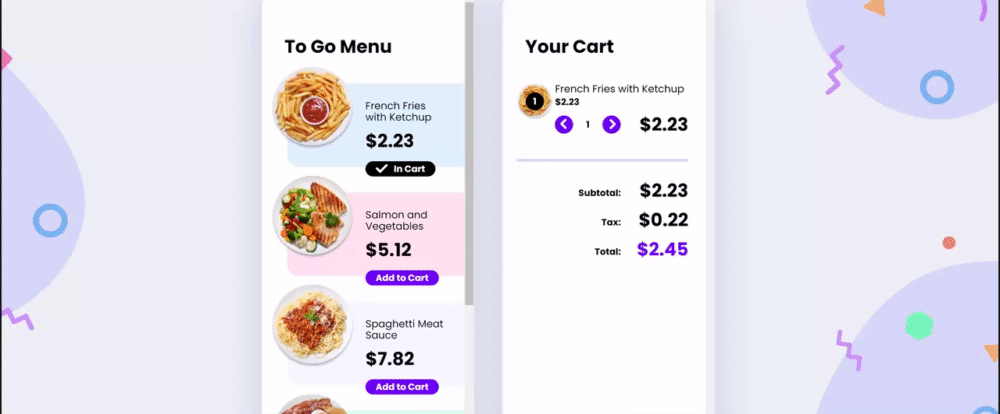

# 02 - E-Commerce Component || Advent of JavaScript



This is the second exercise powered by COMPRESSED<sup>fm</sup> for the [Advent Of Javascript challenge](https://www.adventofjs.com/)

I've made this version with [VueJs](https://fr.vuejs.org/) [Vuex](https://vuex.vuejs.org/) and [Typescript](https://www.typescriptlang.org/)

## Project setup
```
npm install
```

### Compiles and hot-reloads for development
```
npm run serve
```

### Compiles and minifies for production
```
npm run build
```

### Lints and fixes files
```
npm run lint
```

### Customize configuration
See [Configuration Reference](https://cli.vuejs.org/config/).
